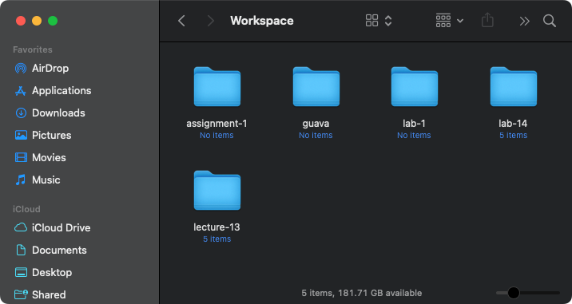

# Definition

A workspace is a defined area or directory where developers organize their project files, source code, libraries, and other necessary resources needed for software development.

The idea of having a Workspace folder is to keep your code base organized on your computer so every time you need to work on a project you know exactly where to find it, i.e., all the necessary resources are gathered and organized to facilitate the development process.

You should create the Workspace folder anywhere on your computer (no matter the operating system). For example, please consider the figure below where the folder was created on MacOS:

The image shows five folders or five projects.

# References

  - <a href="https://en.wikipedia.org/wiki/Software_development_folder">https://en.wikipedia.org/wiki/  Software_development_folder</a>
